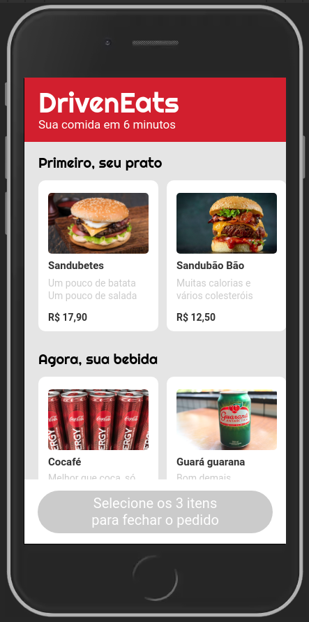
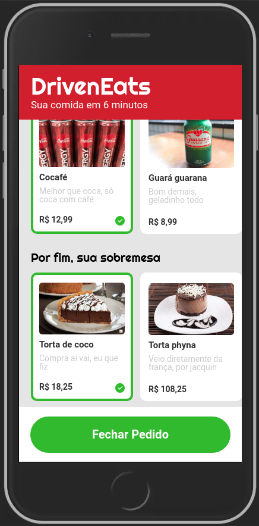
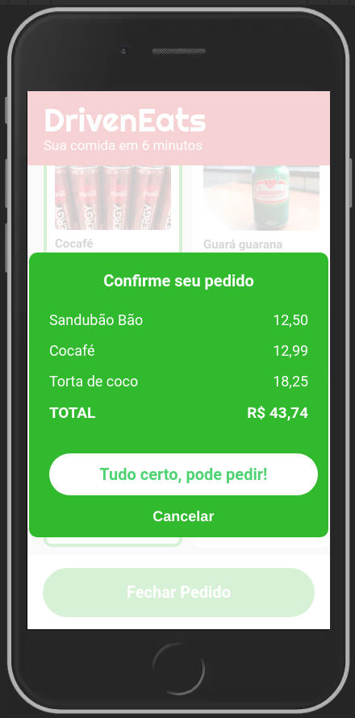
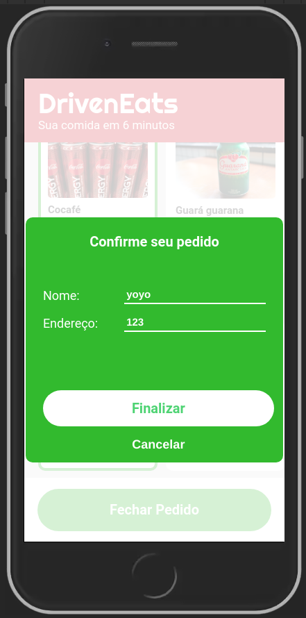
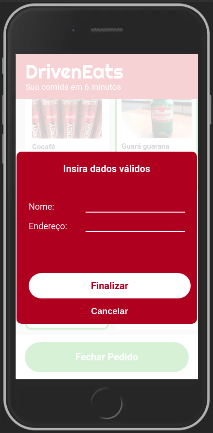

# Driven Eats

Demonstração de um layout e funcionalidades simples de um web-app para pedido de comida online

## Fluxo de dados:
1. Usuário seleciona um combo (Prato principal, bebida e sobremesa);
2. Usuário visualiza o valor total e confirma o pedido;
3. Usuário insere nome e endereço e é redirecionado ao Whats-App do restaurante com uma mensagem pronta;

Tela de seleção:           |  Itens Selecionados:      | Confirmação do pedido: 
:-------------------------:|:-------------------------:|:-------------------------
   |   |  

Inserindo Endereço:        |  Dados Inválidos:      
:-------------------------:|:-------------------------:
   |   
